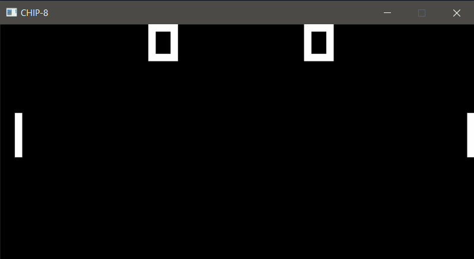

# CHIP-8 Emulator (C++17, SDL2)



A CHIP-8 interpreter written in C++17 with SDL2 for display and input. CHIP-8 is a small virtual machine from the 1970s with 4 KB of memory, 16 registers, a 64×32 monochrome display, and a 16-key keypad. I built this as a learning project to understand how a CPU fetches, decodes, and executes instructions, and how an emulator keeps CPU, timers, and rendering running at different rates.

## Features

- 34 of the 35 standard CHIP-8 instructions (everything except the legacy `0NNN` machine-code call, which modern interpreters ignore)
- 64×32 display with XOR sprite drawing, collision detection (`VF`), and start-position wrap with edge clipping
- 16-key hexadecimal keypad mapped to a QWERTY keyboard
- Delay and sound timers decrementing at 60 Hz, independent of CPU speed
- Fixed-rate main loop: 10 CPU cycles per ~16 ms frame (about 600 instructions per second)
- Stack overflow/underflow checks and readable errors for unknown opcodes
- Unit test suite with no external framework (plain `assert`)

## Build (Windows)

**Prerequisites**

- Visual Studio (MSVC) with the C++ workload
- CMake 3.12 or newer
- SDL2 development libraries (VC version) from <https://github.com/libsdl-org/SDL/releases>, unzipped somewhere, e.g. `C:/Libraries/SDL2-2.32.10`

**Configure and build**

```powershell
mkdir build
cd build
cmake .. -DSDL2_PATH="C:/Libraries/SDL2-2.32.10"
cmake --build .
```

`SDL2.dll` is copied next to the executable automatically after the build.

**Run** (from the project root, so relative ROM paths resolve):

```powershell
.\build\Debug\chip8.exe "roms\IBM Logo.ch8"
```

If no path is given, the emulator loads `roms/IBM Logo.ch8`. Press **Esc** or close the window to quit.

**Run the tests**

```powershell
.\build\Debug\chip8_tests.exe
```

## Controls

The original 4×4 hex keypad maps to the left block of a QWERTY keyboard:

```
CHIP-8 keypad      Keyboard
1 2 3 C            1 2 3 4
4 5 6 D            Q W E R
7 8 9 E            A S D F
A 0 B F            Z X C V
```

## Testing

**Unit tests** (`tests/test_chip8.cpp`) cover every implemented opcode, including edge cases: stack overflow and underflow, carry and borrow flags, register wraparound, `VF` used as the destination register, sprite wrapping and clipping, keypad masking, timers stopping at zero, and invalid opcodes.

**Test ROMs** from the [Timendus chip8-test-suite](https://github.com/Timendus/chip8-test-suite):

| ROM | Result |
|---|---|
| IBM Logo | Renders correctly |
| 3-corax+ | All checks pass |
| 4-flags | All checks pass |
| 5-quirks | Runs to completion; results listed under Design choices |
| 6-keypad | `EX9E` and `EXA1` behave as expected; `FX0A` completes on key press, which differs from the original hardware (see below) |

Test ROMs exposed two gaps the unit tests missed: an 8XY4 flag-ordering bug (4-flags) and a missing BNNN opcode (5-quirks)

## Design choices

CHIP-8 was implemented by many interpreters with slightly different behavior. These are the choices this emulator makes, as reported by the quirks ROM:

| Behavior | This emulator | Original COSMAC VIP |
|---|---|---|
| `8XY1/2/3` reset `VF` | No | Yes |
| `FX55/FX65` increment `I` | No (`I` unchanged) | Yes (`I += X+1`) |
| Display wait (draw syncs to 60 Hz) | No (draws immediately) | Yes |
| Sprite clipping at screen edges | Clip (start position wraps) | Clip |
| `8XY6/8XYE` shift | Shifts `VX` in place (CHIP-48 style) | Copies `VY` into `VX` first |
| `BNNN` jump | `NNN + V0` | `NNN + V0` |
| `FX1E` sets `VF` on overflow | No | No |
| `FX0A` | Completes on key **press** | Completes on key **release** |

Other deliberate simplifications:

- `5XY0` and `9XY0` do not validate that the final nibble is 0.
- Memory accesses through `I` (`DXYN`, `FX33`, `FX55`, `FX65`) are not bounds-checked, so a malformed ROM could read or write outside the 4 KB array. Stack overflow and underflow are checked.
- Frame time is 16 ms (about 62.5 Hz) rather than an exact 16.67 ms.

## Project layout

```
chip8/
├── CMakeLists.txt
├── src/
│   ├── main.cpp      SDL window, rendering, input, main loop
│   ├── chip8.h       Chip8 state and interface
│   └── chip8.cpp     fetch, execute, timers, ROM loading
├── tests/
│   └── test_chip8.cpp
├── roms/             test ROMs and games
└── docs/             screenshots
```

The emulator core (`chip8.cpp`) has no SDL dependency, which is why the unit tests build and run without a window.

## Future work

- Audio: play a beep while the sound timer is above zero (SDL audio)
- Display wait quirk and a configurable quirk profile (VIP / CHIP-48 / SUPER-CHIP)
- `FX0A` release-based behavior as an option
- Accumulator-based timing for an exact 60 Hz
- Bounds checking on memory accesses through `I`
- Debugger and save states

## Credits

- Test ROMs: [Timendus/chip8-test-suite](https://github.com/Timendus/chip8-test-suite)
- Game ROMs: [mir3z/chip8-emu/roms/Pong (1 player).ch8](https://github.com/mir3z/chip8-emu/blob/master/roms/Pong%20(1%20player).ch8)
- [SDL2](https://www.libsdl.org/)

## License

The emulator source code is released under the [MIT License](LICENSE).
Test ROMs and game ROMs in `roms/` belong to their respective authors
and are covered by their own licenses.